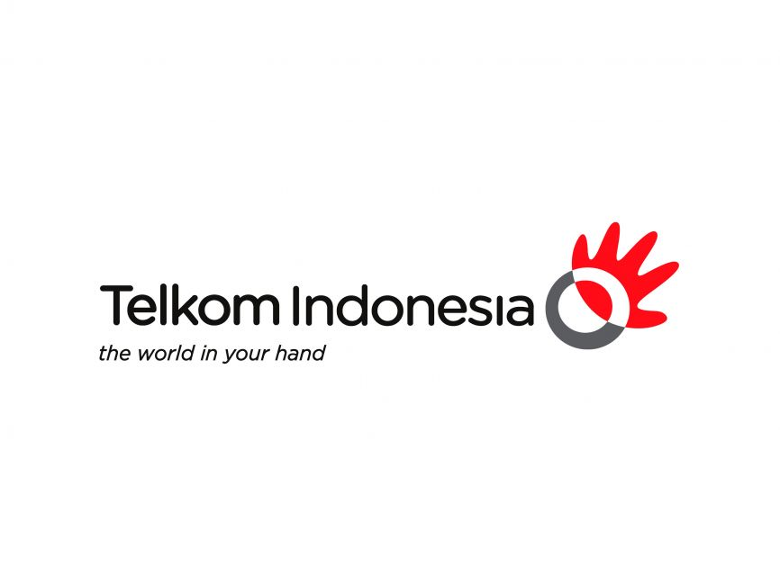

<html>
<head>
<title>
PT TELKOM INDONESIA
</title>
</head>
<body bgcolor="yellow">
<h1>
SELAMAT DATANG DI PT.TELKOM INDONESIA
</h1>
<h4>
Jl.HOS Cokrominoto No.222,Mekar baru,Kota Kisaran Barat,Asahan,North Sumatera 21211
</h4>  

   <h1></h1>
  
   </head>  
   <!--  
     This is the key to making the clock function.  
     When the page loads, it calls the javascript function "setInterval()",  
     which will call our function "updateClock()" once every 200 milliseconds.  
   -->  
   <body onload="setInterval('updateClock()', 200);"align=right>  
     <!-- This is the container for our clock, it can be any HTML element. -->  
     <h1 id="clock"></h1>  
   </body>  

<a href ="pt.html">Home</a> - <a href ="profil.html">profil</a> - <a href ="tabel.html">tabel karyawan</a> - <a href ="kp.html">kontak perusahaan</a> 

     <!-- Here we are using attributes like
        cellspacing and cellpadding -->
 
    <!-- The purpose of the cellpadding is 
        the space that a user want between
        the border of cell and its contents-->
 
    <!-- cellspacing is used to specify the 
        space between the cell and its contents -->
    <h2 align="center" style="color:black;">
       31 JULY 2024
    </h2>
     
 
    <table bgcolor="lightgrey" align="center"
        cellspacing="5" cellpadding="5">
 
        <!-- The tr tag is used to enter 
            rows in the table -->
 
        <!-- It is used to give the heading to the
            table. We can give the heading to the 
            top and bottom of the table -->
 
        <caption align="top">
            <!-- Here we have used the attribute 
                that is style and we have colored 
                the sentence to make it better 
                depending on the web page-->
        </caption>
 
        <!-- Here th stands for the heading of the
            table that comes in the first row-->
 
        <!-- The text in this table header tag will 
            appear as bold and is center aligned-->
 
        <thead>
            <tr>
                <!-- Here we have applied inline style 
                     to make it more attractive-->
                <th style="color: white; background: purple;">
                    Sun</th>
                <th style="color: white; background: purple;">
                    Mon</th>
                <th style="color: white; background: purple;">
                    Tue</th>
                <th style="color: white; background: purple;">
                    Wed</th>
                <th style="color: white; background: purple;">
                    Thu</th>
                <th style="color: white; background: purple;">
                    Fri</th>
                <th style="color: white; background: purple;">
                    Sat</th>
            </tr>
        </thead>
 
        <tbody>
            <tr>
                <td></td>
                <td>1</td>
                <td>2</td>
                <td>3</td>
                <td>4</td>
                <td>5</td>
                <td>6</td>
            </tr>
            <tr></tr>
            <tr>
                <td>7</td>
                <td>8</td>
                <td>9</td>
                <td>10</td>
                <td>11</td>
                <td>12</td>
                <td>13</td>
            </tr>
            <tr>
                <td>14</td>
                <td>15</td>
                <td>16</td>
                <td>17</td>
                <td>18</td>
                <td>19</td>
                <td>20</td>
            </tr>
            <tr>
                <td>21</td>
                <td>22</td>
                <td>23</td>
                <td>24</td>
                <td>25</td>
                <td>26</td>
                <td>27</td>
            </tr>
            <tr>
                <td>28</td>
                <td>29</td>
                <td>30</td>
                <td bgcolor="green">31</td>
                <td></td>
                <td></td>
                <td></td>
            </tr>
            <tr>
                <td></td>
                <td></td>
                <td></td>
                <td></td>
                <td></td>
                <td></td>
                <td></td>
            </tr>
        </tbody>
    </table>
	
	
	
	

   	  

<h2>
TENTANG TELKOMGROUP
</h2>

<h4>PT Telkom Indonesia (Persero) Tbk (Telkom) adalah Badan Usaha Milik Negara (BUMN) yang bergerak di bidang jasa layanan teknologi informasi dan komunikasi (TIK) dan jaringan telekomunikasi di Indonesia. Pemegang saham mayoritas Telkom adalah Pemerintah Republik Indonesia sebesar 52.09%, sedangkan 47.91% sisanya dikuasai oleh publik. Saham Telkom diperdagangkan di Bursa Efek Indonesia (BEI) dengan kode “TLKM” dan New York Stock Exchange (NYSE) dengan kode “TLK”.</h4>

<h4>Dalam upaya bertransformasi menjadi digital telecommunication company, TelkomGroup mengimplementasikan strategi bisnis dan operasional perusahaan yang berorientasi kepada pelanggan (customer-oriented). Transformasi tersebut akan membuat organisasi TelkomGroup menjadi lebih lean (ramping) dan agile (lincah) dalam beradaptasi dengan perubahan industri telekomunikasi yang berlangsung sangat cepat. Organisasi yang baru juga diharapkan dapat meningkatkan efisiensi dan efektivitas dalam menciptakan customer experience yang berkualitas.</h4>

<h4>Kegiatan telkomGroup tumbuh dan berubah sesuai dengan perkembangan teknologi baru, informasi dan digitalisasi, namun tetap dalam koridor teknologi telekomunikasi dan informasi. Hal ini terlihat dari lini bisnis baru yang dikembangkan, melengkapi bisnis legacy perusahaan yang sudah ada<h4>

		

<h5>
©PT.TELKOM INDONESIA 2024.ALL RIGHTS RESERVERS<h5>

<h5>
POWERED BY KELOMOK 4
</h5>
</body>
</html>

